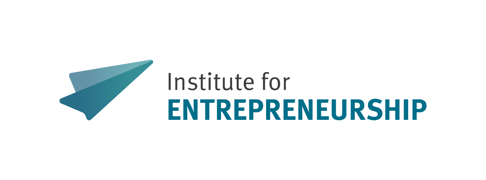

  <picture>
    <source media="(prefers-color-scheme: dark)" srcset="assets/logo-dark.png">
    <source media="(prefers-color-scheme: light)" srcset="assets/logo-light.png">
    
  </picture>

This organization publishes the code, templates and default repository settings of the Institute for Entrepreneurship at the University of Münster.

## Who we are

The [Institute for Entrepreneurship](https://www.wiwi.uni-muenster.de/ent/en) researches and teaches at the interface of established companies and start-ups. The team is led by Prof. Dr. David Bendig. The institute is part of the [Center for Management](https://www.wiwi.uni-muenster.de/cfm/) and connected to the [REACH – EUREGIO Start-up Center](https://www.reach-euregio.de/), which transfers research into practice.

## Repositories

### Templates and organization defaults

- [.github](https://github.com/MuensterEntrepreneurship/.github) – This organization profile and the default community health files that apply to all repositories of the organization.

## Contributing

Open an issue in the repository concerned to report a problem or propose a change. Open a pull request against the default branch for code or text changes. Describe what you changed and why in the pull request.

## Contact

University of Münster  
Institute for Entrepreneurship  
Leonardo-Campus 9  
48149 Münster  
Germany

- E-mail: [ent@wiwi.uni-muenster.de](mailto:ent@wiwi.uni-muenster.de)
- Website: [German](https://www.wiwi.uni-muenster.de/ent/de) · [English](https://www.wiwi.uni-muenster.de/ent/en)
