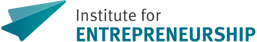
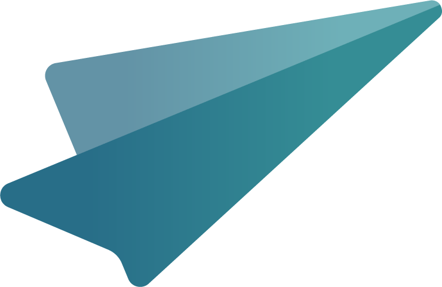

  <picture>
    <source media="(prefers-color-scheme: dark)" srcset="assets/logo-dark.svg">
    <source media="(prefers-color-scheme: light)" srcset="assets/logo-light.svg">
    
  </picture>

## Who we are

The [Institute for Entrepreneurship](https://www.wiwi.uni-muenster.de/ent/en) researches and teaches at the interface of established companies and start-ups. The team is led by Prof. Dr. David Bendig. The institute is part of the [Center for Management](https://www.wiwi.uni-muenster.de/cfm/en) and connected to the [REACH – EUREGIO Start-up Center](https://www.reach-euregio.de/), which transfers research into practice.

## Contact

  
   
   
  Institute for Entrepreneurship
   
  University of Münster
   
  Leonardo-Campus 9, 48149 Münster, Germany
   
   
  <a href="mailto:ent@wiwi.uni-muenster.de"> E-mail</a>
  &nbsp;&nbsp;&nbsp;&nbsp;
  <a href="https://www.wiwi.uni-muenster.de/ent/en"> Website</a>

